# 全面解析“世界模型”：定义、路线、实践与AGI的更近一步

撰稿：张珺玥

如今的AI看起来似乎“无所不能”：能写深奥的论文、复杂的代码，做出顶级的画面和视频。然而，它仍然缺乏理解世界、预测世界以及在世界里推演并行动的能力。

而为了解决这个问题，OpenAI、谷歌、微软等大公司，Yann LeCun、李飞飞等顶尖学者都开始抢着研究同一件事，那就是——世界模型。

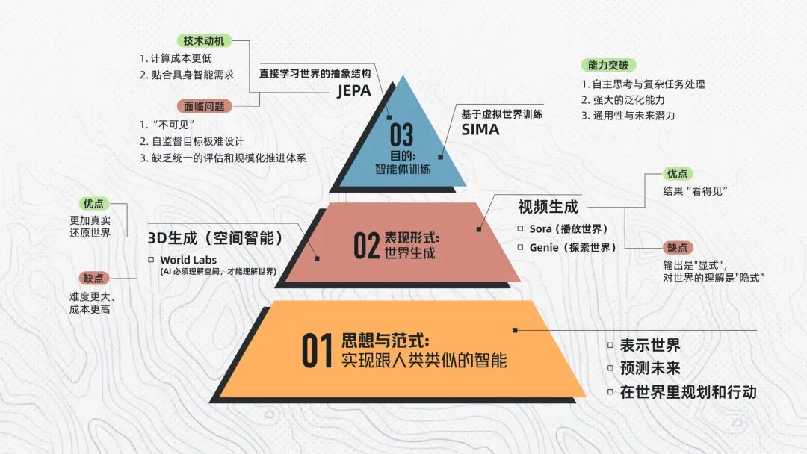

不少AI科学家认为，随着多模态走向普及和成熟，如果这条技术线完全跑通，它将彻底重塑整个AI格局。但我们也注意到，“世界模型”的爆火也带来了新的问题：仿佛整个AI圈，一夜之间都变成了“世界模型”：无论是做视频生成的、做机器人的，还是自动驾驶、游戏开发等等，只要跟“世界”沾点边，几乎都是世界模型。

世界模型到底是什么，它跟大语言模型有什么区别？这些看起来完全不同的路线，是在做同一件事吗？世界模型的到来，又会给各行各业以及整个社会带来什么样的改变？以及，它会是人类通往AGI的终极密码吗？

这期视频，硅谷101团队花了几个月时间做了深度研究、采访和后期特效制作，想解释清楚这个被业界不少大佬认为是“AI下个十年最重要的研究方向”到底是在研究啥。希望对大家理解AI最前沿的讨论和研发有所帮助，内容有点硬核有点长，大家enjoy～

（本文为视频改写，欢迎大家收看以下视频）

**01**

# **什么是世界模型？**

关于世界模型的定义，目前仍然还没有一个非常清晰的、被所有人都认可的说法。但我们可以先来聊一聊这个概念的起源，以及它究竟想解决什么事情。

先从一个再简单不过的问题开始：你是怎么知道，一杯水放在桌边，它可能会掉下去的呢？

科学家们认为，人类之所以能预测杯子会掉落、门往哪边开、球会顺着斜坡滚，是因为从很小的时候，我们就在脑子里构建了一个“世界怎么运作”的模型。我们能预判下一秒会发生什么，能想象“如果我这么做，会怎么样”，并在脑海中提前排演各种可能性，在认知科学中，这被称为**心智模型（Mental Model）**。

早在上个世纪，科学家们就已经开始研究人类的心智模型。1943年，Kenneth Craik在其著作《解释的本质》中就提出：人在对现实作出反应之前，会先在大脑中构建一个“小规模的世界模型”，用它来模拟可能发生的过程，再据此选择行动。也就是说，我们每个人脑子里，都有一个看不见的“小世界”。

既然人类智能依赖于这样的内部世界，很多AI研究者也开始追问：机器要想具备真正的智能，是否也需要一个属于自己的世界？

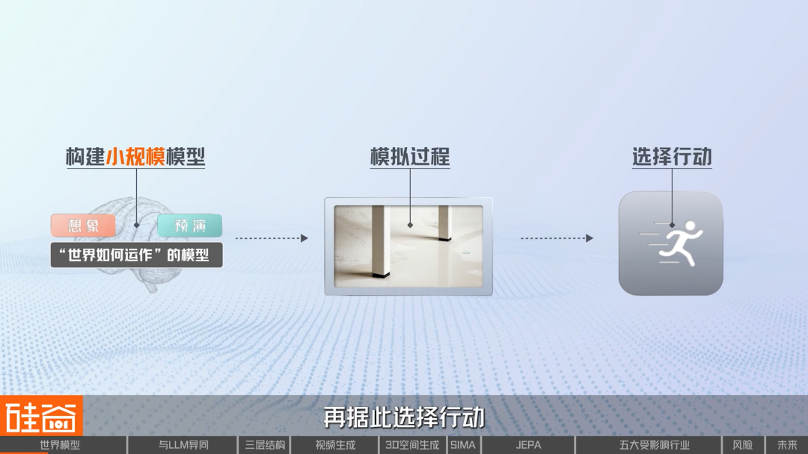

于是，在AI和强化学习的早期研究中，这个思想以不同的名字反复出现。比如在1991年，Richard Sutton、Doina Precup和Satinder Singh在论文《An Integrated Architecture for Learning, Planning, and Reacting》中提出了后来被称为Dyna架构的设计思路。

Dyna的核心在于：**智能体在学习行动策略的同时，也要学习model of the world。**也就是，当我采取某个动作之后，世界会如何变化，这也是第一次将“世界模型”明确确立为智能体内部的一项基础能力。

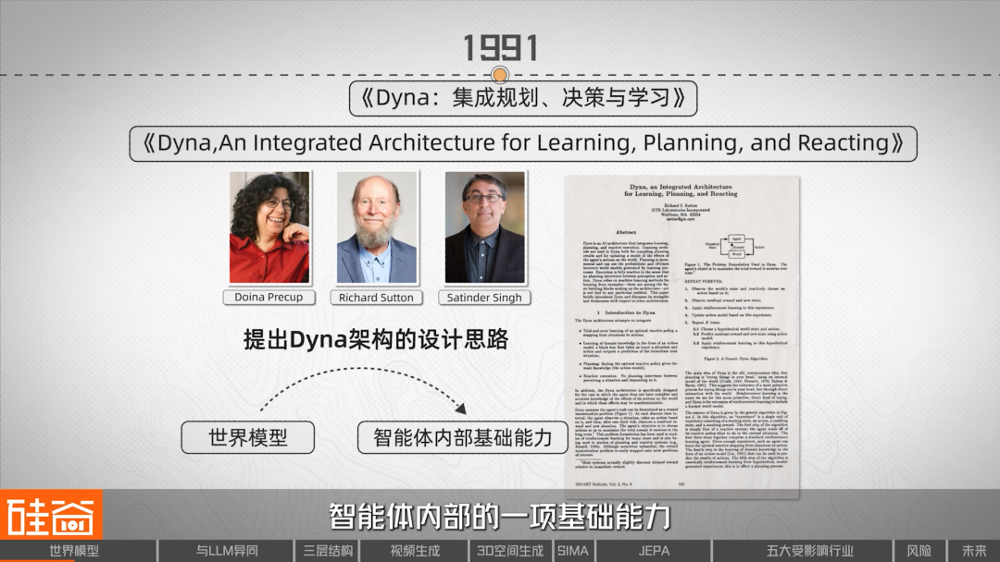

在此之后，世界模型并没有沿着单一路线发展，而是在不同研究领域中被不断拆解、强化和改写。比如在强化学习和机器人中，它体现为Forward Model；在自动控制和工业系统中，则发展出了Model Predictive Control（模型预测控制）。

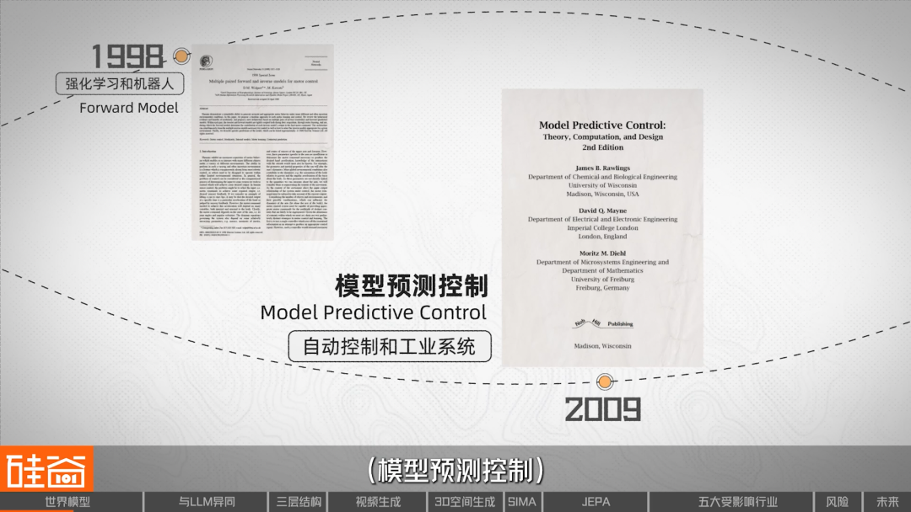

这些理论的名字虽然不同，但背后共享着同一个核心假设：**智能体之所以能做出更好的决策，不是因为反应更快，而是因为它能在行动之前，在内部世界中先“看到未来”。**

在此后在很长一段时间里，世界模型更多停留在偏理论、偏算法的层面，直到深度学习和表示学习逐渐成熟。2018年，Google Brain的David Ha与深度学习元老级教父Jürgen Schmidhuber共同发表了论文《World Models》。这篇论文正式提出了“世界模型”（World models）这个精炼化的名称，同时还给出了一个比较简洁的世界模型理解框架：

**世界模型=观察世界（V）+预测世界（M）+在内部世界中学习行动（C****）****，**对应的是视觉（Vision）、记忆（Memory）和控制（Controller）三个核心模块。

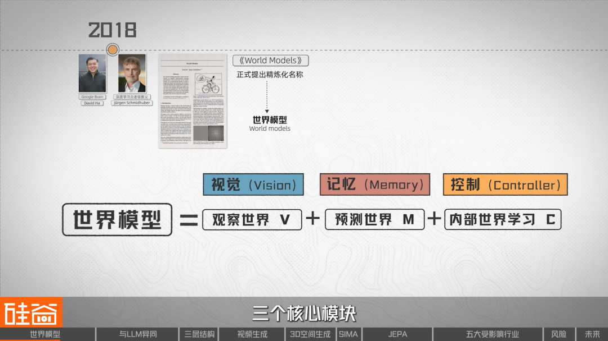

我们用一个简单的例子来解释一下：想象你是一个从未打过乒乓球的新手，当你站在球台前，眼睛接收到的是大量复杂的视觉信息。视觉模块（V）并不会记住每一个像素，而是会自动提取出对决策真正重要的部分，它将原本上百万像素的画面压缩成仅有几十个数字的精华编码。

记忆模块（M）接收到这些编码后，便立即开始内部模拟。经过多次练习，你的大脑已经建立起对乒乓球运动规律的理解。记忆模块就像你内心的“物理引擎”，能预测“如果我这样做，会发生什么”。

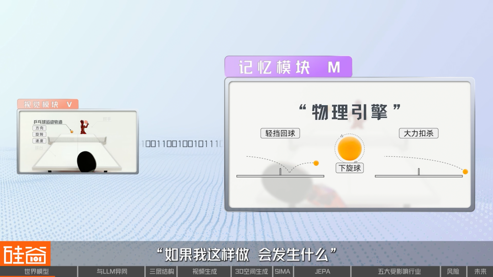

所以，当球飞来时，视觉模块提取特征，记忆模块模拟方案，而控制模块（C）就主要是在记忆模块（M）所创造的“内部世界”中进行训练，你并不需要真的挥拍一百次试错，而是在记忆模块的“梦境”中找到最佳策略后，再在现实中只执行一次最优解。而**这种“想象-规划-行动”的认知过程，正是人类智能的核心特征。**

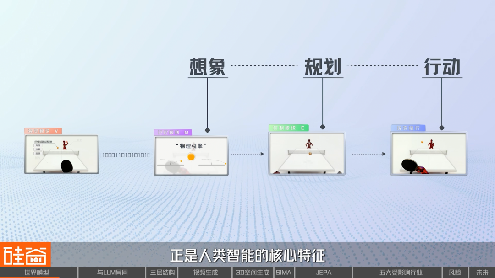

在这篇论文中，他们也做出了一个有意思的demo，让模型在完全虚拟的小世界里学会了玩一款赛车游戏，证明了AI可以像人类一样，通过内部世界的想象来进行学习。

总结下来，研究者们普遍认为世界模型应该具有三大特质**：**

**第一，表示世界（Representation）。**模型能够理解所处的环境里有什么、物体在哪里，以及物与物之间是什么关系。

**第二，预测未来（Prediction）。**它能够对事件进行模拟和生成，如果我推一下杯子、打开一扇门、往前走两步，世界会发生什么样的改变。

**第三，在世界里规划和行动（Planning & Control）。**当能预测接下来会发生什么之后，我应该如何采取行动。

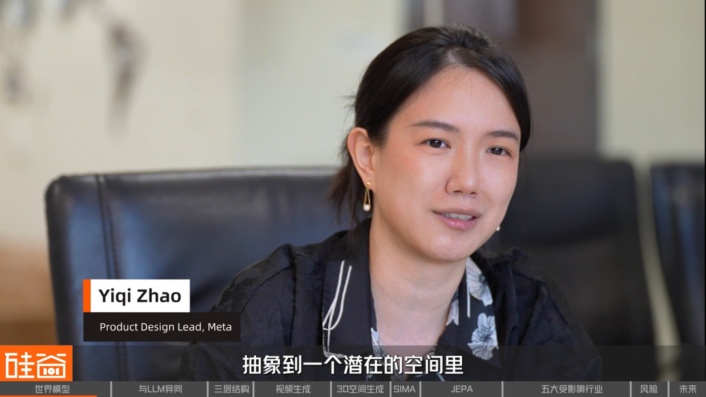

> Yiqi Zhao
>
> Product Design Lead, Meta
>
> 它是把世界抽象到一个潜在的、被压缩过的空间里，在这个潜在空间里，你能够通过学到的物理规律，去做对未来的预测，形成一个对真实世界的模拟器。相当于它是一个模拟系统，有点像是一个缩小的平行宇宙。这感觉就像如果你有一个真正的AI大脑，它就拥有自己的AI世界观。因为可以做预测，所以就可以去做未来的推演，就可以做决策。

世界模型的本质，就是想让AI从一个“只会回答问题”的语言机器，走向能够真正像人类一样“会观察、会推理、会行动”的真正智能体。但是问题来了，作为一个上个世纪就开始被研究的概念，为什么突然在最近一段时间火了起来？它跟我们现在所熟悉的大语言模型又有什么区别或是联系呢？

**02**

# **为什么要研究世界模型**？

Chapter 2.1 世界模型与大语言模型的不同

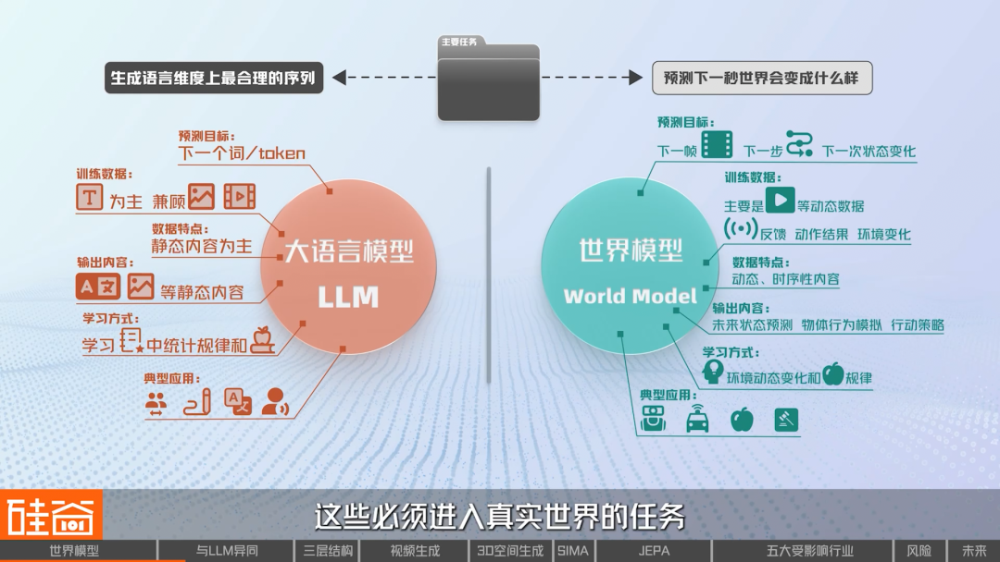

从主要任务和预测目标来看：

* 大语言模型的目标是**生成在语言维度上最合理的序列，预测的是下一个词或token**。比如你问“杯子会从桌子上掉下来吗？”，它回答“会”，因为这是在无数文本里出现过的正确答案。
* 世界模型的任务是预测**“下一秒世界会变成什么样”**，预测的是下一帧画面、下一步动作、下一次状态变化，**它需要理解物理规律、空间关系和动态变化**。

从训练数据来看：

* 大语言模型**主要依赖文本数据**，也包括一些图像和视频，数据特点是**以静态内容为主**。
* 世界模型则**主要依赖视频等动态数据**，包括摄像头看到的画面、机器人的传感器反馈、动作的结果、环境的变化，**数据特点是动态的、时序性的**。

从输出结果看：

* 大语言模型输出的是语言或图像等内容。
* 世界模型输出的是**对未来状态的预测、对行为的模拟，以及可执行的行动方案****。**

从学习方式看：

* 大语言模型是**通过语言间接理解世界**，更像一个“知识容器”。
* 世界模型是**通过交互和推演直接理解世界**，不仅能“看见”，还能“预测”和“干预”。

因此，大语言模型更适合对话、写作、翻译、问答。而世界模型更适合机器人、自动驾驶、物理模拟和决策系统这些必须进入真实世界的任务。

此前，李飞飞也曾在采访中精炼总结过两者在目的和训练模态上的不同：

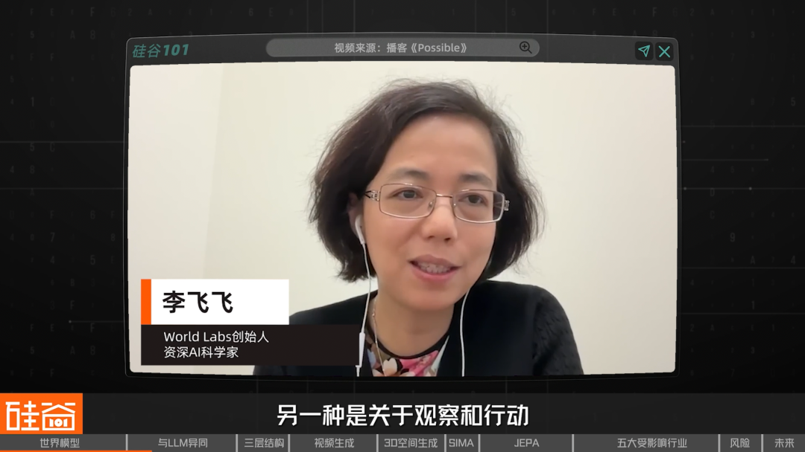

> **李飞飞**
>
> **World Labs创始人、资深AI科学家**
>
> 一种是关于表达，另一种是关于观察和行动。因此它们本质上是截然不同的模态。大型语言模型的基本单元是词库，无论是字母还是单词，而我们使用的世界模型的基本单元是像素或体素。

## Chapter 2.2 大语言模型路线遇到瓶颈了吗？

虽然大语言模型和世界模型是两条不一样的技术路线，但它们的终极目标都是要实现通用人工智能。那么现在为什么要突然非常关注世界模型呢？是因为大语言模型这条路已经走不动了吗？

关于这个问题，研究界目前仍然存在着不同的观点。

一些研究者们旗帜鲜明地提出，大语言模型是死路，这一派的代表人物之一就是Yann LeCun。

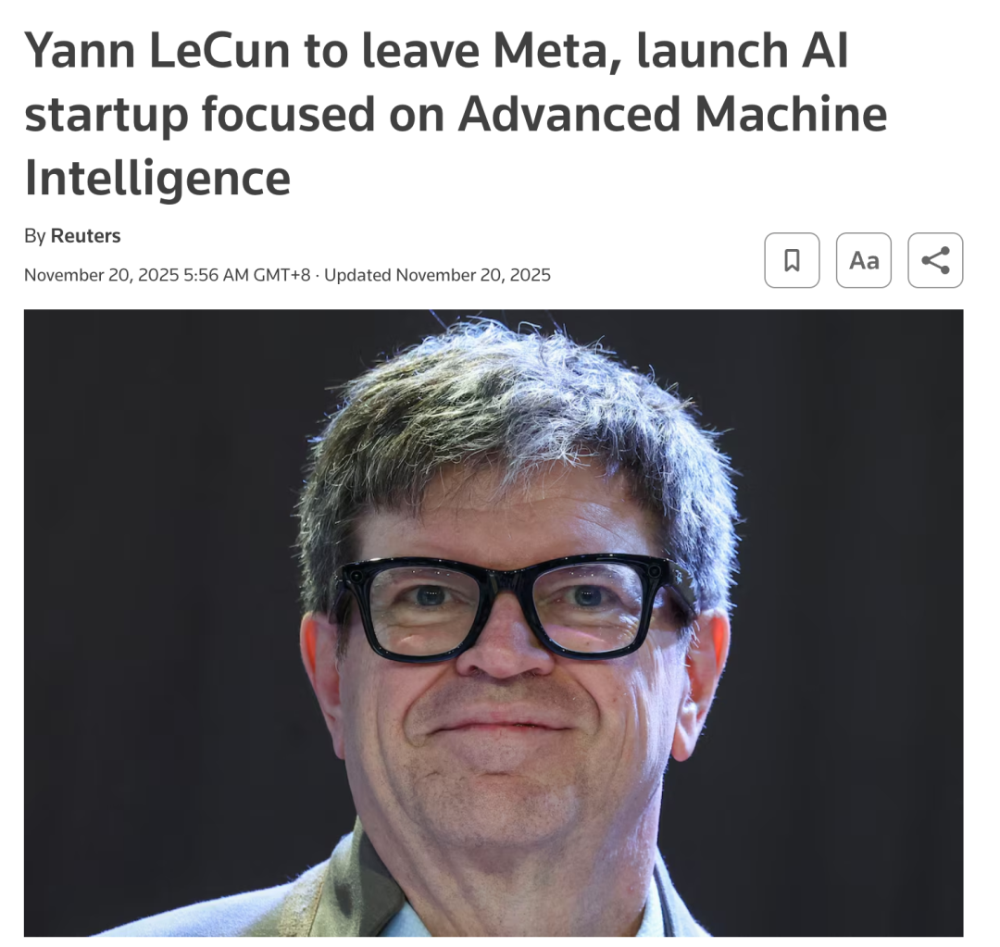

图片来源：Reuters

离开工作了12年的Meta后，这位65岁的图灵奖得主、深度学习先驱并没有选择退休，而是回到巴黎创立了一家名为Advanced Machine Intelligence的公司。他要做的事情，与硅谷主流的大模型路线截然不同。

他在最近的采访中表示，AI领域的Moravec悖论一直存在。所谓Moravec悖论，是指AI可以轻松处理对人类极其困难的高智力任务，比如下棋、微积分、读论文。但直觉性的感知、社交等人类和动物轻松完成的初级技能，对机器却极其困难。**Yann LeCun认为，这个悖论至今未解决，就是因为我们研究AI的路线错了。**

人类智能的核心在于不依赖海量数据就能自主学习，但现在的LLM是在拟合语言的统计相关性，对现实世界几乎没有直接建模能力，如果继续沿着LLM路线“堆量”，最多只能做出一个更会说话、更会写字的模型。

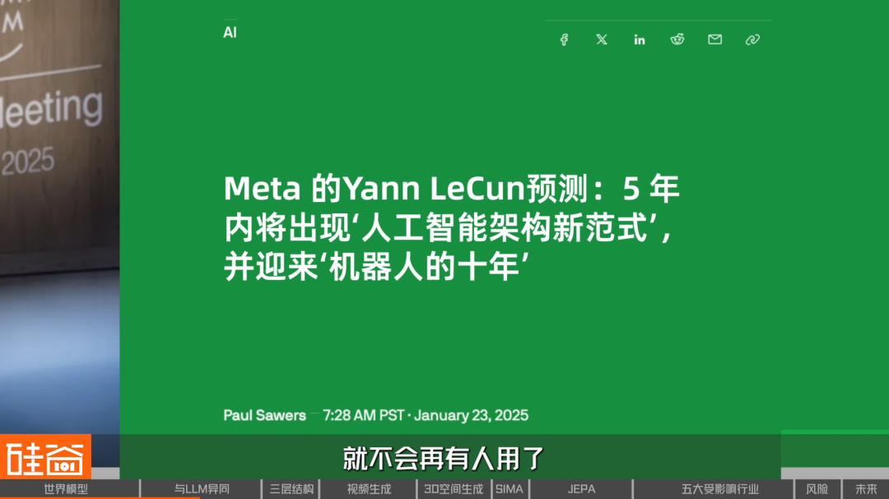

他甚至放言称，再过5年，GPT之类的大语言模型就不会有人再用了。而关于大家都在憧憬AGI很快到来，他也认为是一种幻想，最乐观也要5到10年，机器的智能才能勉强接近一只狗。

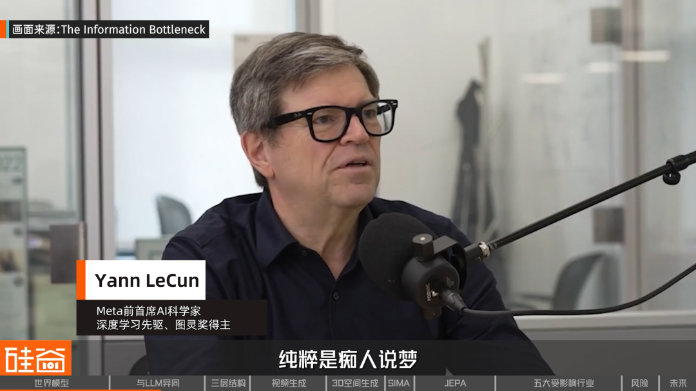

> **Yann LeCun**
>
> **Meta前首席AI科学家、深度学习先驱、图灵奖得主**
>
> 那些吹嘘一两年内就能实现通用人工智能的人，纯粹是痴人说梦，彻头彻尾的妄想，因为现实世界远比这复杂得多。你不可能通过“将世界token化”和使用大语言模型来解决这个问题，这根本不可能实现。

而除了Yann LeCun之外，学术界中有不少的大佬级人物也都持有类似的观点，比如图灵奖获得者、强化学习之父Richard Sutton。

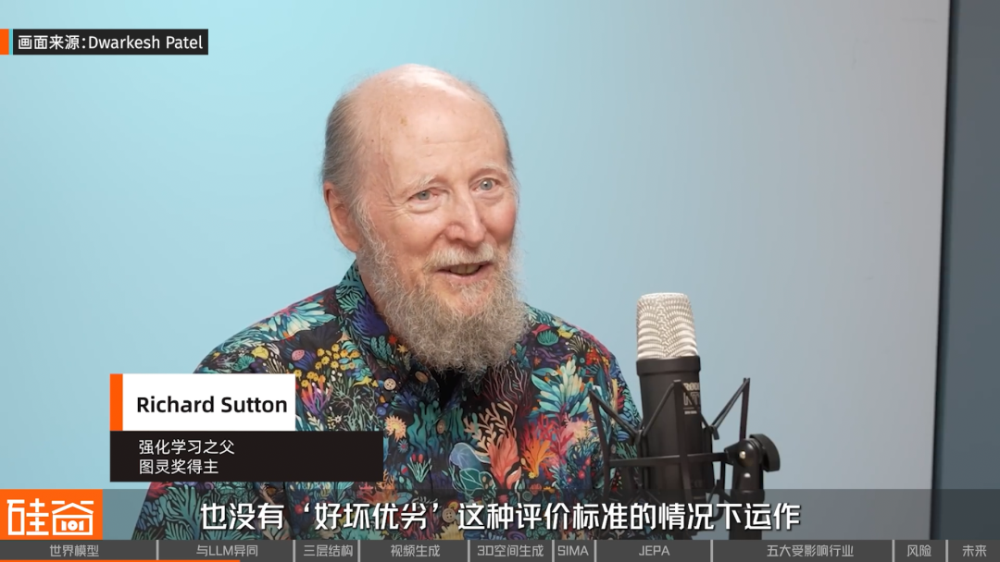

> **Richard Sutton**
>
> **强化学习之父、图灵奖得主**
>
> 大语言模型试图在没有目标、也没有‘好坏优劣’这种评价标准的情况下运作，这其实一开始就走错了方向。

李飞飞最近也在密集地发声，她说大语言模型仍然是黑暗中的文字匠人：能言善辩，却缺乏经验；知识渊博，却脱离现实。

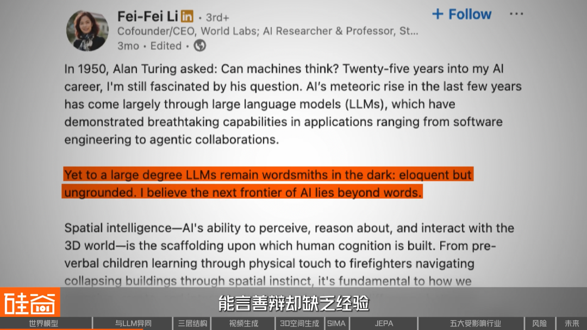

所以，大语言模型这条路线是不是真的走不通了呢？严格来说，现在还没有标准答案，但有几件事，大家开始有了越来越多的共识**：**

**首先，单纯把模型做得更大，已经不会再像过去那样带来立竿见影的突破。**规模继续上去当然可以变强，但在算力、数据、能源、成本这些硬约束下，它的性价比正在迅速下降。

**其次，AI需要更直接地接触“真实世界”。**语言世界太干净了，它无法提供现实世界里那种混乱、连续、充满不确定性的因果经验。AI想继续往前走，需要新的输入方式、需要多模态感知、需要和环境互动。

**最后****，大家普遍认为世界模型和大模型将会是一个互补的关系。**陈羽北就在访谈中提到，世界模型并不是要完全将大语言模型推翻重来，而是为大语言模型补上“现实世界”的维度。

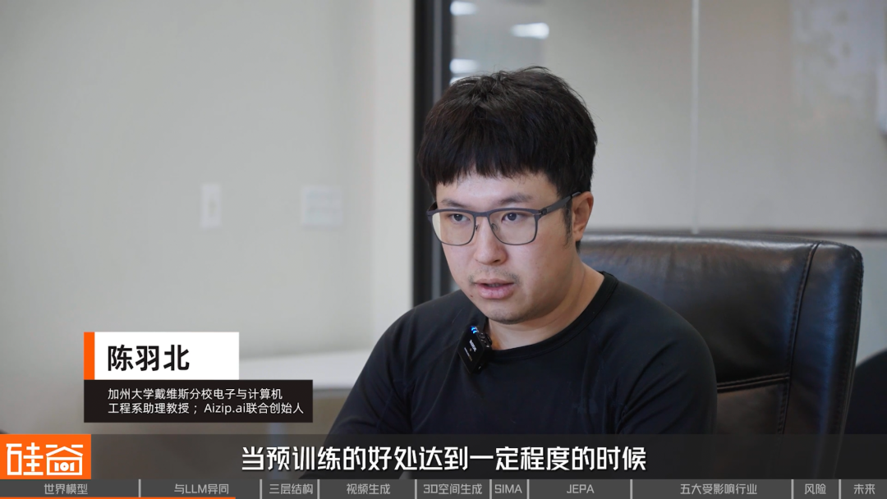

> **陈羽北**
>
> **加州大学戴维斯分校电子与计算机工程系助理教授**
>
> 在语言中我们有了GPT的话，当预训练的好处达到一定程度的时候，它可以被快速地变成任何的下游应用。世界模型可以被认为是一个大号的GPT，它包含了感知和控制。如果我们在这里也能获得根本上的成功，未来我们所有的机器人、所有的智能体都可以用这样预训练和后训练的方式产生，这有可能会彻底地解锁一些AI的应用场景。

## Chapter 2.3 为什么是现在？

既然世界模型如此重要，为什么最近一段时间它才突然被行业普遍讨论和关注呢？

第一个原因就是上文我们所讨论的，大模型的原生能力遇到了天花板，但人们对AI在现实生活中的期待却越来越高。

另一个原因是，随着多模态时代的到来，让我们第一次有能力训练“真正的世界模型”。训练世界模型需要海量的视觉与动作数据、多模态传感器输入、大规模视频模型能力以及足够强的算力来支持“世界推演”，这些条件直到最近几年才逐步成熟。

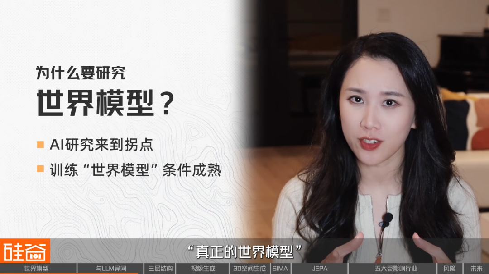

总得来说，**因为大模型的天花板已经显现，而且全行业都在迈向具身智能，再加上我们现在有了让AI看世界、理解世界的技术基础，世界模型就顺理成章地成为了下一轮AI竞赛的核心舞台。**而这些尝试，很快在行业里分成了几条不同的技术流派。

**03**

# ****当前推进世界模型的主要路线****

虽然世界模型的最终目标看起来是相对清晰的，但落实在实践探索层面，却常常会让人感到困惑。比如有的在做视频生成，有的在做3D场景，有的在做机器人，有的在做智能体，它们都叫做世界模型，但在做的事情似乎完全不同。

我们究竟应该怎么去理解，现在整个行业到底在做些什么？

关于这个问题，我们的嘉宾Yiqi结合世界模型的理论知识以及她在Meta的一些实践观察，在采访中提出了一个我们认为非常有帮助于大家理解的框架，就是**把整个世界模型领域拆解成****“三层结构”**，在这个架构中：

**底层，是世界模型的思想与范式****。**也就是我们之前所讨论的，世界模型的抽象、预测、规划特征，以及它要解决的问题。这一层涉及到目前很多研究层面的创新。

**第二层，是世界模型的当前的“表现形式”****。**指模型到底是用什么方式来表示世界和预测世界，世界应该如何被生成出来。

**第三层，是世界模型的“目的层”，**也就是智能体训练，让AI最终能在这个世界里行动、做任务、完成决策。

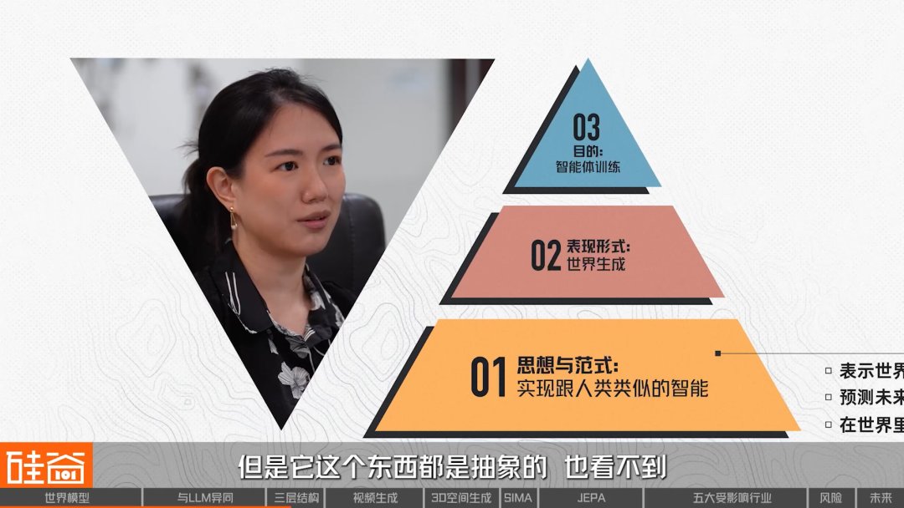

> Yiqi Zhao
>
> Product Design Lead, Meta
>
> Latent MDP（潜在状态表示）+Learn Dynamics（环境动力学模型）+Simulator（内部模拟能力），这三者结合起来就是底层的世界模型核心层级，但是它是抽象的、不可见的。
>
> 如果要让人和AI看到，需要有一个表现形式，这个表现形式需要AI帮忙生成，所以生成的层级会比它之前的层级稍微高一点。

> 等生成完了之后，AI大脑里有了世界观，就可以看到这个世界了。那接下来这个世界里需要有东西，让人和AI智能体都要活在里面。
>
> 所以智能体在里面存在的方式就是：我终于有一个宇宙了，我要在里面玩、学习，要对这个世界造成影响，和这个世界有一个交互，互相产生影响。

**04**

# **世界模型的表现形式：世界生成**

如果我们把当前产业界的主要尝试放在这个框架中去看的话，它们其实很多都聚焦在第二层级：世界生成。这也是目前整个领域最热闹的地方。

## Chapter 4.1 为什么要先做世界生成

很多研究者认为，构建世界模型的第一步不是让AI直接“推理”或“行动”，而是让它能够去“生成世界”，这看似简单，却是世界模型的根基。

所谓**“理解世界”，本质是理解世界如何随时间和行为变化。**物体如何移动、光线如何变化、风吹过树叶会发生什么，要获得这种对“世界演化”的直觉，最直接的方式就是让模型先能够生成一个可连续变化的世界。

此外，强大的世界生成模型能为智能体提供廉价的训练场。比如训练一个机器人倒咖啡，让它在现实中倒几万次、打碎几千个杯子显然性价比太低，而地震、火灾、车祸这些边缘场景也可以在虚拟世界中自由进行反事实推理的实践。

因此，**世界生成既是世界模型的外壳，也是整个体系的入口**。而在世界生成这件事情上，目前主要有两大技术路线：

第一类，用“视频生成”的方式去重建世界，包括OpenAI Sora、谷歌的Genie等。

第二类，用“3D空间生成”的方式去显式建模世界，其中的代表是李飞飞的World Labs。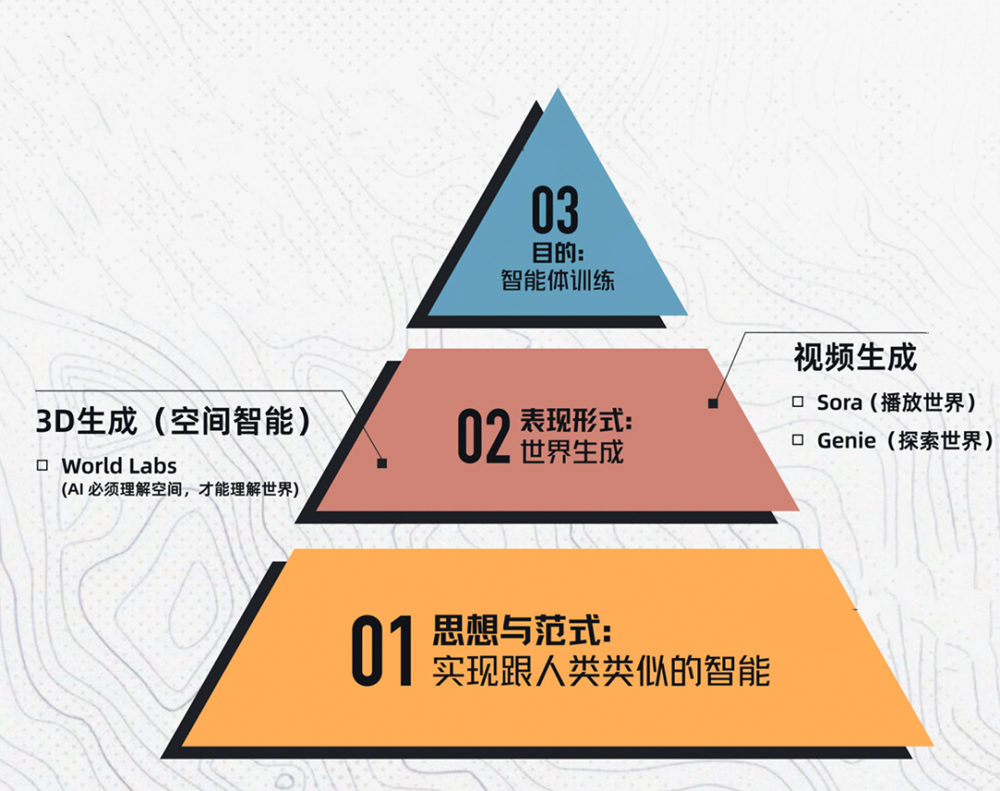

## Chapter 4.2 视频生成路线

视频生成应该是目前最具代表性的、也是最为大众所熟悉的世界模型路线。它的目标很直观，就是尝试让AI直接生成一个“能动起来的世界”，并让这个世界随着时间流动、演化、变化。

OpenAI在发布Sora之初，它们就将其定义为一个“世界模拟器”。Sora并不是简单地把一段视频用静态图像一张张“拼出来”，而是让画面里的事物能够随着时间连续地演化。这些视频细节之所以令人震撼，是因为人们发现，**模型似乎开始真的“理解”了事物变化的背后规律**，它知道光线在材质上如何变化，知道一个物体在受到外力后该怎样移动。而目前与Sora类似的，还有Seedance、Veo、Kling等一系列视频生成模型。

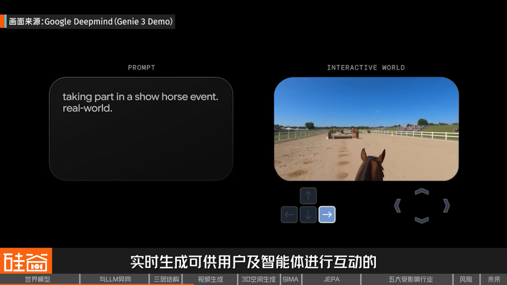

如果说Sora等模型是能够去“播放一个世界”，Google的Genie系列模型则是让我们能去“探索一个世界”。在Genie 3中，模型能够根据用户的文本或图像提示，实时生成可供用户及智能体进行互动的虚拟环境。相比前代产品，Genie 3的核心突破在于**“实时交互性”和“长时间一致性”**，用户可以跟模型进行长达数分钟的互动。

> **Yiqi Zhao**
>
> **Product Design Lead, Meta**
>
> Genie 3跟传统的视频生成模型很不同的一点在于，它生成出来的内容，你是可以跟它实时交互的。你生成出来的内容，比如黑板上写了字，我走到别的地方回来之后这个字它还在黑板上。说明它虽然还是有frame by frame（逐帧生成）的生成方式，但是它已经能够记住世界里面的这些状态。

Genie 3的这种可控性，意味着模型内部不再只是预测下一帧是什么，而是已经在模拟“未来的世界状态”。它让视频生成从“播放”走向“交互”，开始从“电影式生成”走向“游戏式模拟”，更接近一个真正的“世界引擎”，也更接近智能体将来需要使用的环境。

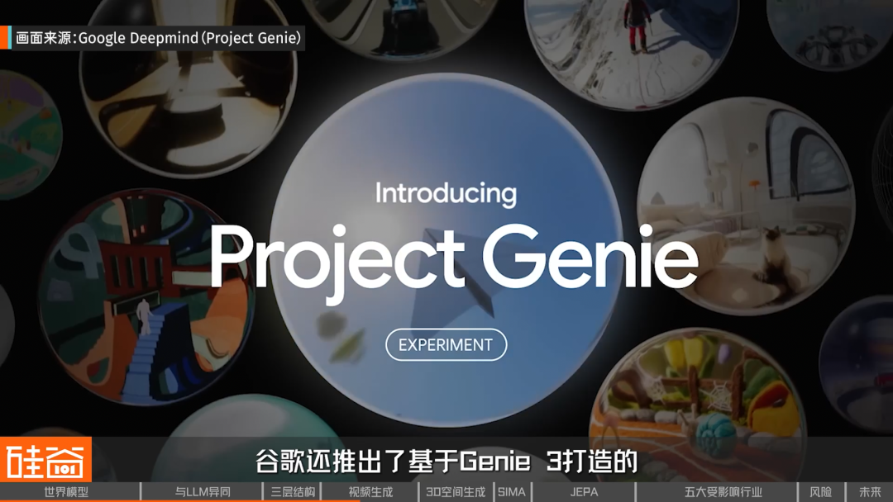

就在今年1月，谷歌还推出了基于Genie 3打造的实验室原型Project Genie，首次将Genie 3的能力第一次封装成为了一个“人人都可以直接上手体验”的产品形态。它的强大在于多模态的深度协同：由Gemini提供逻辑支撑，Nano Banana Pro生成高精度的场景与角色，再由核心引擎Genie 3将静态设计“激活”为可互动的3D世界。依托TPU v5的算力，Project Genie实现了720p/24fps的实时环境渲染，同时允许用户对同一个世界进行“重新混剪”，具有长达60秒的强一致性记忆。

Project Genie的发布意味着“世界模型”或许开始真正从PPT走进现实，它不再只是个会“变魔术”的算法，而是通过一句话就能“变”出一个可运行的小型游戏世界的生产力工具。

从行业视角来看，**视频生成路线有一个非常明显的优势就是它的结果“看得见”**。我们能直接观察世界模型是否具备物理一致性、是否理解时空结构，而且它能快速商业化落地，影视、广告、教育、游戏都能立刻使用。

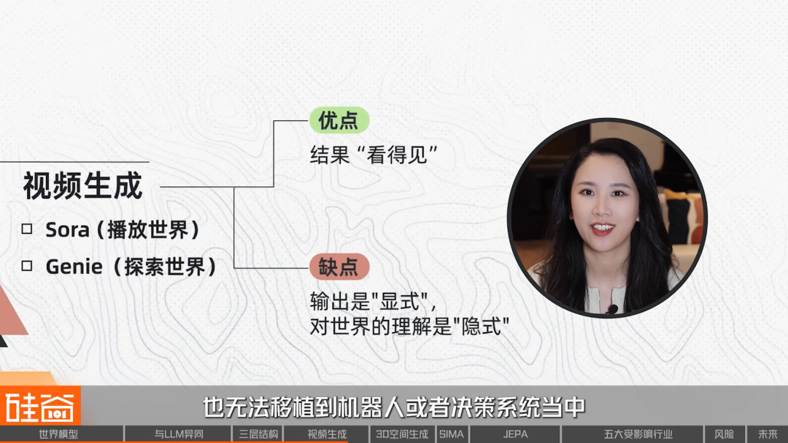

从技术角度看，视频生成的优点也很突出：首先，训练数据相对容易获得。互联网上有大量真实世界视频，为模型学习世界规律提供了训练空间。其次，它对Scaling Law非常敏感，模型规模越大、数据越多，视频的一致性和物理合理性就呈指数级提升。此外，视频数据天然包含多样化场景，模型泛化能力也更强。

**正因为这种“可观察性”和“可规模化训练”的组合，让视频生成路线在过去一、两年成为世界模型最引人注目的方向。**

但视频生成的局限也同样明显，最重要的一点是，虽然它的输出是“显式”的，但内部对世界的理解是“隐式”的，我们无法直接读取，也无法将能力直接移植到机器人或决策系统中。

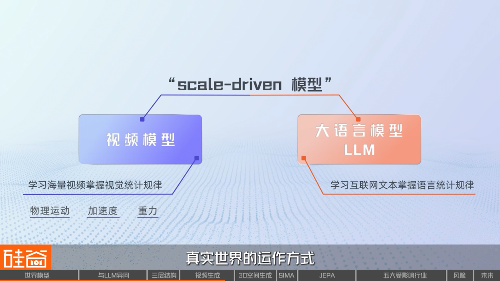

视频生成路线其实和大语言模型很像，两者都是典型“scale-driven（规模驱动）模型”。语言模型通过学习互联网文本掌握语言统计规律，视频模型通过学习海量视频掌握视觉统计规律，区别在于：**视频数据天然包含物体运动、加速度、重力等物理特征，因此视频模型能更直接地看到真实世界的运作方式。**

但和语言模型一样，视频模型理解的世界规律依然“藏在权重里”。语言模型预测下一个token，视频模型预测下一帧，但都很难告诉你世界内部的结构是什么。比如你让Sora生成一辆车的行驶视频，造型和光影可能很逼真，但如果你问，这辆车的长宽高是多少？被挡住的轮胎在哪里？它答不上来。因为Sora并没有构建一个3D的几何车辆模型，它只是学到了像素组合的概率分布。

## Chapter 4.3 3D生成（空间智能）路线

所以视频生成虽然是目前最直观、最能应用落地的一步，但它目前也只是画出了世界的一层皮，但还缺少有血有肉的框架。那如何才能勾勒出世界表层下的框架呢？

李飞飞提出的思路是：3D生成，也就是空间智能。

与视频生成相比，3D生成路线走的是一条截然不同的技术选择，不是把世界画出来，而是把世界建出来。这也是李飞飞领导创建的World Labs目前的技术路线。它们不追求画面有多逼真或“电影级”连续性，而是**更关注世界的结构**，包括物体在哪里？空间的几何关系是什么？物体之间如何相互影响？生成的世界是否能被“进入”与“操作”？

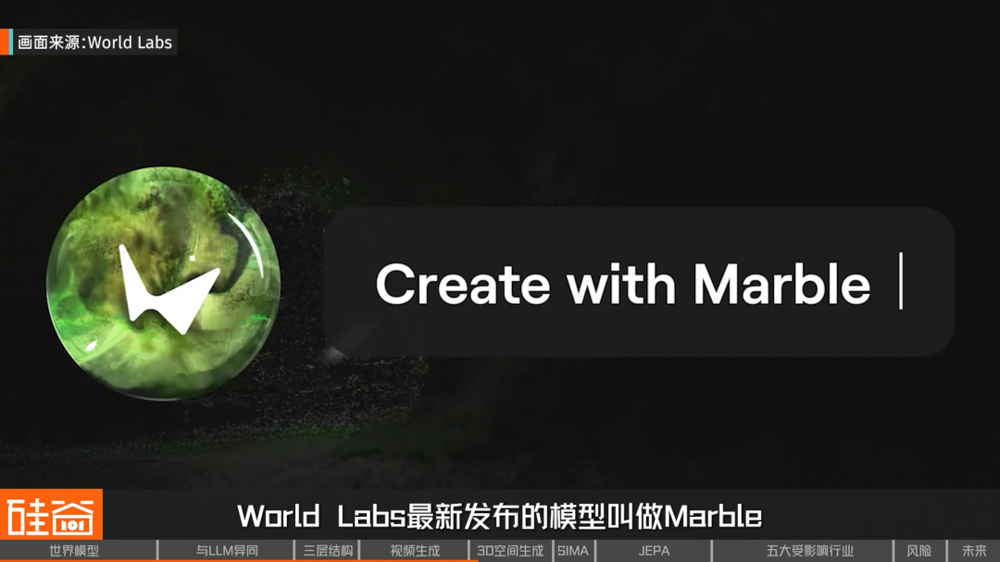

WorldLabs最新发布的模型叫Marble**，**它的特点是给它一个语言指令、一张照片或视频，就能通过高斯泼溅技术重建出完整的3D场景结构。简单来说，Marble就像建筑师，看到图片时不只看到“像素”，而是看到背后的三维结构。比如你同样问它图片里汽车的长宽高，它能回答出是长4.5米、宽1.8米，还能输出3D网格文件。

为什么李飞飞如此强调3D呢？因为她认为真正的世界就不是2D的，而是3D的，AI必须理解空间，才能理解世界。人类能抓住物体、避开障碍、记住空间，是因为我们天生具备构建3D模型的能力。机器人要抓取物体需要知道形状、体积、位置，自动驾驶要理解空间和距离，这些都不是二维像素能表达的。AI要真正进入现实世界，首先要知道“世界的三维结构”。

从技术层面看，**3D生成路线有个巨大优势：与视频模型的“隐式物理直觉”不同，它生成的是显式结构**，模型知道每个物体的具体位置，因此物理模拟、规划、控制都更容易实现。一旦掌握这些显式信息，它就能继承传统物理引擎的优势，确保碰撞、遮挡、施力等表现严格正确，成为“可操作世界模型”的底座。

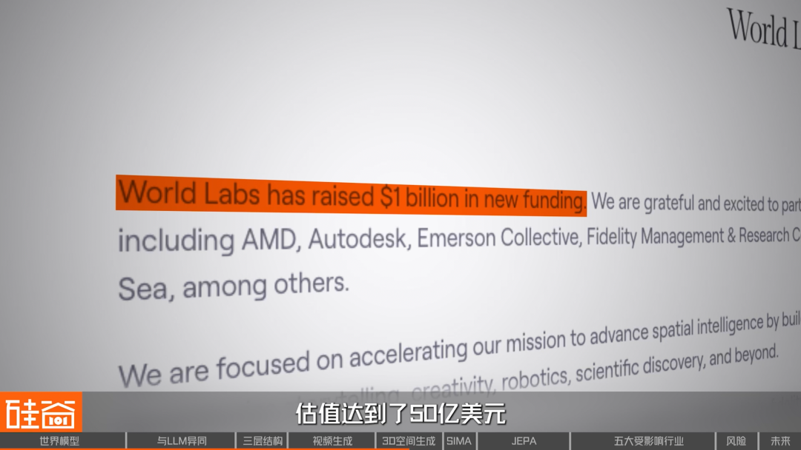

此外，3D生成在游戏、影视制作、室内设计等场景也能快速落地，让它能够在商业转化上具有优势。不久前，Worldlabs宣布了最新一轮10亿美元的融资，估值达到了50亿美元，短短一年半时间，它的估值飙升了5倍之多，一定程度上也反映了市场对于“3D生成”这条路线潜力的认可。

虽然3D生成对世界模型的发展具有巨大的战略意义，但它的实现难度也要比视频生成大很多：

**首先是训练数据稀缺。**互联网是巨大的2D视频矿山，但3D数据却很少。高质量3D数据主要靠LiDAR、结构光扫描仪等专业设备采集，不仅设备贵，流程还繁琐，标注成本也比2D高出一个量级。

**其次是几何结构难建。**3D模型需要确保生成的物体封闭、无穿模、无破损，而预测柔体、流体、链式碰撞等复杂3D动态交互则难度更大。

**最后****是****对算力需求很大。**无论是训练中的3D渲染还是实时物理模拟，计算量都远超2D模型，直接推高了研究门槛。

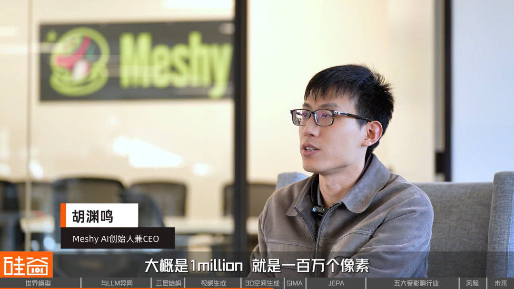

> **胡渊鸣**
>
> **Meshy AI CEO**
>
> 我们如果要生成一张1024x1024分辨率的图片，大约一百万个像素。但是如果要生成一个3D的模型，最大的挑战就是多出来一个新的维度，就不太可能直接用1024x1024x1024分辨率这样的表示方式去做，计算量实在是太大了，所以大家就发明了很多新的创造性方法：
>
> 比如Meshy用的技术路线，是基于扩散模型或者自回归模型，通常先生成一个低分辨率版本的模型，然后再去把它Upscale（上采样）。在Upscale（上采样）的过程中，就会发现有一些区域不属于我们关心的范围，所以在这种情况下，我们就可以把计算量集中在我们特别关心的区域。

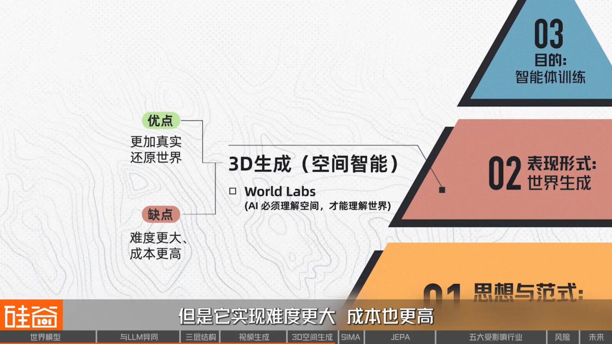

总结来说，**3D生成路线能够更加真实地去还原世界，但它实现难度更大、成本更高。**

不过我们以上讨论的其实都是如何把世界生成出来，但光有生成，还远远不够，因为世界模型的真正的目标不是去生成一个世界，而是要让AI在这个世界里行动。

**05**

# **世界模型的目的：智能体训练**

如果“世界生成”是为了让AI看见世界、重建世界，“智能体训练”就是要让AI能在这个世界里“做事”，从“世界长什么样”走向“我能在这个世界里做什么”。目前，业界主要有两种探索路线。

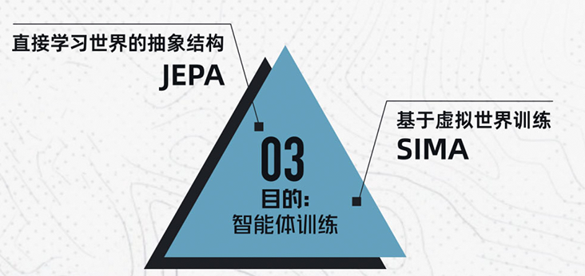

## Chapter 5.1 基于虚拟世界训练路线——SIMA

第一条路线，就是直接把世界生成模型当成“训练环境”，让AI在虚拟生成的世界里不断去犯错、探索、总结，最终学会一套可以迁移到真实世界的能力，这一类的代表是Google SIMA。

SIMA的思路非常直接：既然现实世界太复杂、真实的训练太昂贵，那我们就用虚拟世界来教AI如何行动，而游戏就成为了它最佳的训练场。视频游戏作为复杂、可交互、实时反馈的环境，一直是AI发展的摇篮，从早期的Atari到AlphaStar在《星际争霸II》中打到世界前0.2%，DeepMind一直用游戏训练更智能的AI。

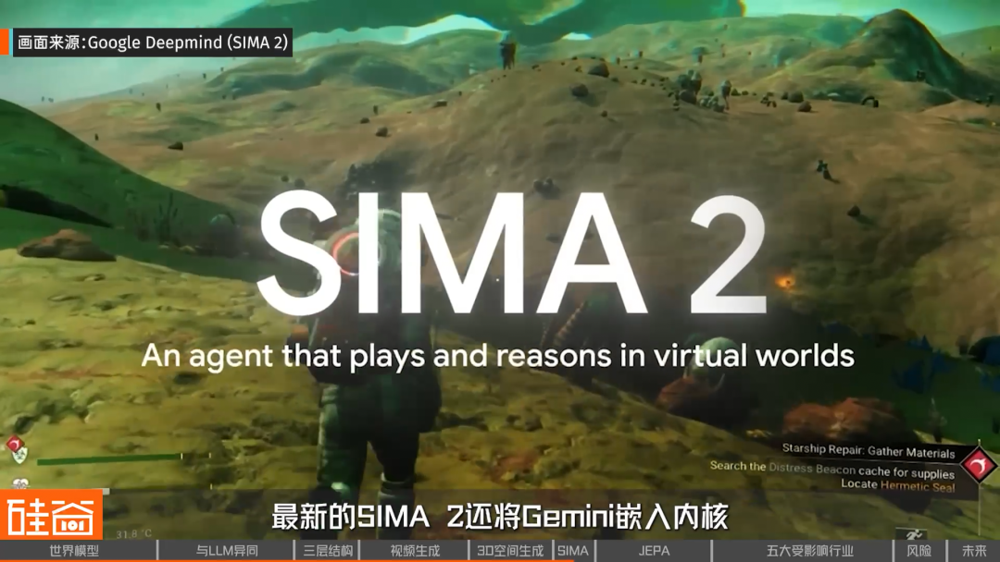

而**SIMA的训练方式就是把AI放进很多不同类型的游戏环境里去“练级”。**最新的SIMA 2还将Gemini嵌入内核，并首次使用Genie 3生成的游戏世界进行了训练。

SIMA 2展现出几个令人瞩目的能力突破：

**首先，它不仅能“跟指令做事”，还能“自己思考”。**它可以理解复杂、多步、抽象的任务，在陌生环境中自主探索、规划行动、寻找解决方案。

**其次，它具有强大的“泛化能力”，能在从未见过的游戏环境中表现出色****。**比如在Genie实时生成的世界中仍能合理辨别方向、理解指令、采取有意义的行动。此外，SIMA 2被设计为能跨游戏、跨环境执行任务的通用AI智能体，这也为将来的具身机器人迁移奠定了基础。

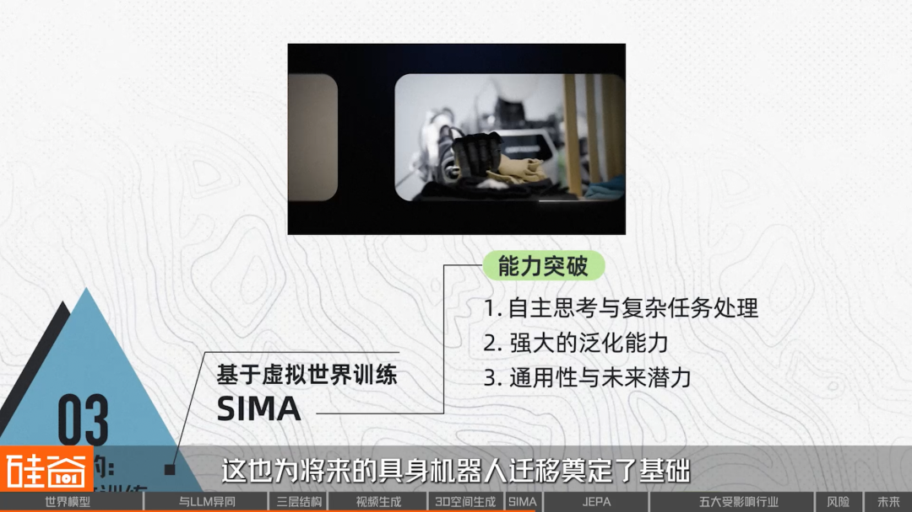

SIMA想做的事情，显然比“玩游戏”本身更大。游戏只是现实世界的缩影，它最终想要实现的，是让AI能在任何3D世界里行动、探索、推理、解决问题。然而对于这个目标，不是所有研究者都认为“要行动，就必须先生成一个世界”。以Yann LeCun代表的另一派，就选择了一条完全不同的路线。

## Chapter 5.2 直接学习世界的抽象结构——JEPA

Yann LeCun实现世界模型的思路是：不用去把世界“画”出来，而是让AI直接去学习世界的抽象结构。

在他看来，不管是生成图片、生成视频，还是生成3D世界，生成式模型都有一个共同的问题：消耗了大量算力去“画细节”，却未必真正理解了世界的结构。比如人类学习走路时，我们只需要知道：地面在哪里，障碍物在哪里，下一步该往哪走。

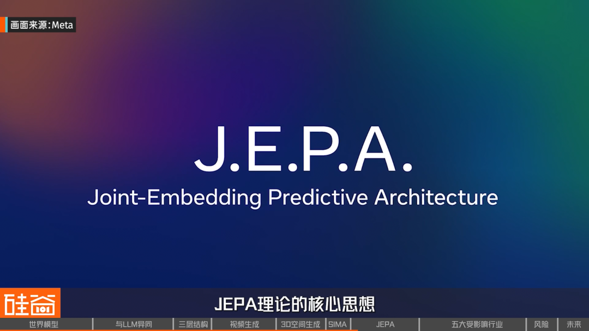

**理解世界的结构，比生成世界的外观更重要。**这正是Yann LeCun所提出的JEPA（Joint Embedding Predictive Architecture，联合嵌入预测架构）理论的核心思想。JEPA不预测图像、不预测像素，也不重建视觉内容，它做的事情是把真实世界压缩成一个抽象的、高维的潜在表示，然后在这个潜在空间里进行预测。预测的目标可以是空间上被遮挡的区域，也可以是时间上的后续状态。

我们来举个简单的例子：如果你轻轻推一个球，视频模型要预测的是下一帧里球的位置、阴影、光照、材质反射。但JEPA不关心这些，它只关心球会往哪个方向滚，速度会怎么变，会不会撞到障碍物，哪些变化与任务和决策相关。**它学习的是未来的结构，而不是未来的画面。**

JEPA的基本结构可以拆成三件事：首先，用Encoder（编码器）将视觉和动作压缩成抽象表征，然后用Predictor（预测器）预测这些抽象状态在未来如何变化，最后将预测结果与真实未来状态的编码进行对齐，让模型学会捕捉世界的关键因果结构。

基于JEPA架构，Yann LeCun在Meta也先后发布了I-JEPA和V-JEPA，前者让AI理解静态图像的结构，后者则让AI学习视频中世界随时间变化的规律。

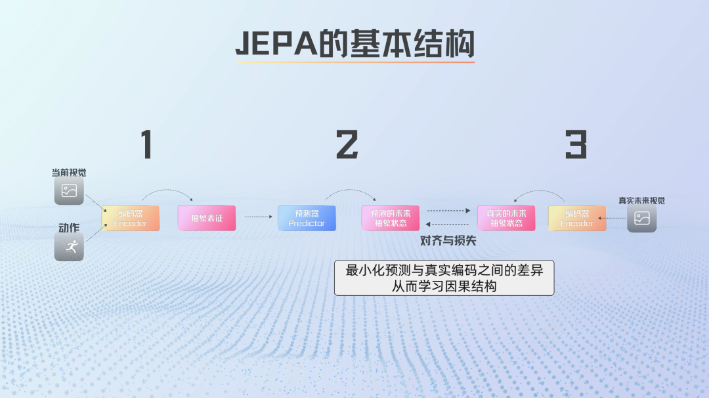

JEPA的路线背后，有非常重要的技术动机：

首先，生成像素既昂贵又低效，而绝大多数像素信息与行动决策无关。JEPA不“画世界”，因此计算成本更低。

其次，由于只保留关键结构信息，JEPA更容易捕捉因果关系，也更具跨场景、跨任务的泛化能力。

更重要的是，这种抽象、结构化的世界表示，更接近机器人和具身智能真正需要的“可操作世界”。比如对于机器人来说，它不需要知道物体的光影纹理，它只需要知道物体的可达性、跟自己的位置关系以及下一步该做什么，而JEPA的输出的就是这种结构化的抽象信息。

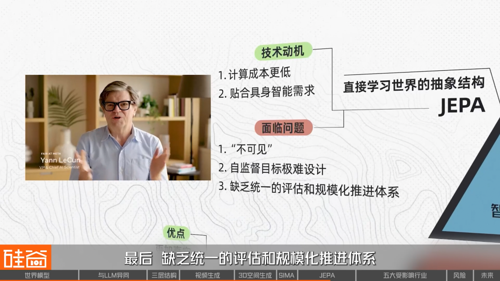

早在几年前，Yann LeCun就已经在为JEPA路线摇旗呐喊了，但它至今仍然未能成为世界模型的研究的主流，因为JEPA路线在实际推进中面临了很多现实问题：

首先，它是“不可见的”。Sora能用逼真的画面震撼所有人，Genie可以生成可探索的游戏世界，WorldLabs能用3D场景告诉你“我理解了空间结构”。但JEPA学到的所有东西，都藏在一个抽象的潜在空间里，这意味着我们难以直接看到和验证模型到底“理解了什么”。

其次，它的自监督目标极难设计。JEPA不像视频生成那样有现成的目标，你给它一帧让它预测下一帧，JEPA想预测的是“未来的结构”。但什么才是“结构”？哪些因素该保留、哪些该忽略？目前仍没有统一答案。

最后，缺乏统一的评估和规模化推进体系。JEPA的表征质量藏在潜在空间里，研究社区多依赖下游任务或行为表现来评估模型，缺乏类似图像生成或语言模型那样统一的benchmark（基准指标），这也使不同设计路线之间的效果比较变得更加困难。正因为这些限制，JEPA更像一个“世界模型的前额叶原型”，方向很可能是对的，但距离成熟落地还仍然有一段距离。

到这里，我们把世界模型最核心的几条技术路线都梳理了一遍：有人用视频把世界“画”出来；有人用 3D 把世界“搭”出来；有人在虚拟世界里训练行动智能；也有人干脆不画世界，想让AI直接学习世界的结构。

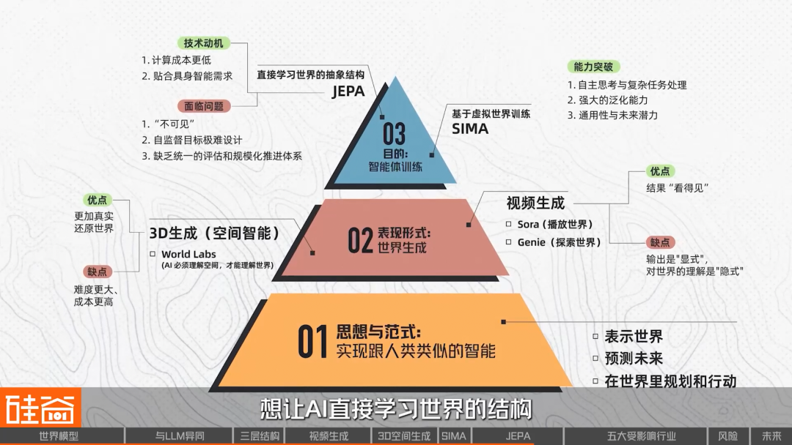

当然，还有一些我们没有展开的路线：比如Dreamer这一类以动力学为核心的世界模型更专注于控制与想象；有的试图从物理规律出发，用可微分模拟器去逼近真实世界；也有越来越多工作，正在模糊世界模型、预测模型与决策模型之间的边界。

这些路线看起来方向不同，但它们正在指向同一个未来：**让AI不再只是“输出信息”，而是真正理解世界、推理世界、在世界里行动。**

Yiqi表示，因为目前世界模型在落地层面还在早期阶段，并没有看到哪一条路线具体的商业应用形式，所以包括Meta在内的大厂们，实际是在各个路线上都在做布局和研究。

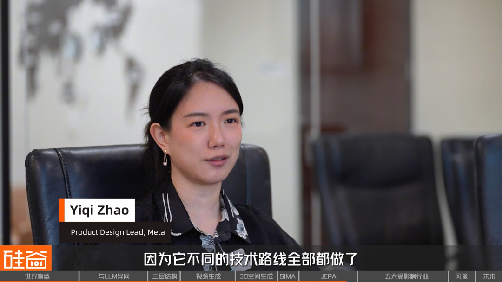

> **Yiqi Zhao**
>
> **Product Design Lead, Meta**
>
> Meta在世界模型的路线上，不同的技术路线全部都做了，主要是因为它的用户场景和垂直场景的需求不同。所以为游戏服务的我们就做了AI游戏引擎，叫做Meta Horizon Studio。为内容创作来服务，我们就做了纯视频方向的。为了数字重建和3D重建，我们就做了高斯泼溅的方式。所以我们希望能够把方方面面的需求都概括进去，各种场景都适用，我相信其他公司也是这样想的。

不过可以预见的是，当世界模型真正成熟，对产业带来的改变，绝对不会只是让“视频生产效率更高”这么简单，它将是一次横跨软件、硬件、制造、娱乐等众多行业的系统性冲击。

**06**

# **世界模型会改写哪些关键行业？**

## Chapter 6.1 机器人

如果说有哪个行业，会最直接地被世界模型撬动，那一定是机器人行业。

过去几十年，机器人的发展受制于硬件、算力和应用场景等多重因素。但更深层、也更关键的瓶颈在于它们还不“懂”世界，因此难以实现跨环境的迁移和泛化。今天的绝大多数机器人看起来很厉害，但它们做的一切，本质上都是“被编程好的动作”，所以只要环境稍微变化，它们就会立刻“失能”。

**机器人行业过去一直难以扩张的原因就在于：每一项新任务，都意味着一次新的工程项目。**

而世界模型带来的，是让机器人拥有“世界的内部模型”。它能看到现在，也能预测未来，知道物体怎么动，也能推断自己的动作会产生什么后果。它能先在脑子里模拟，再决定要不要执行。

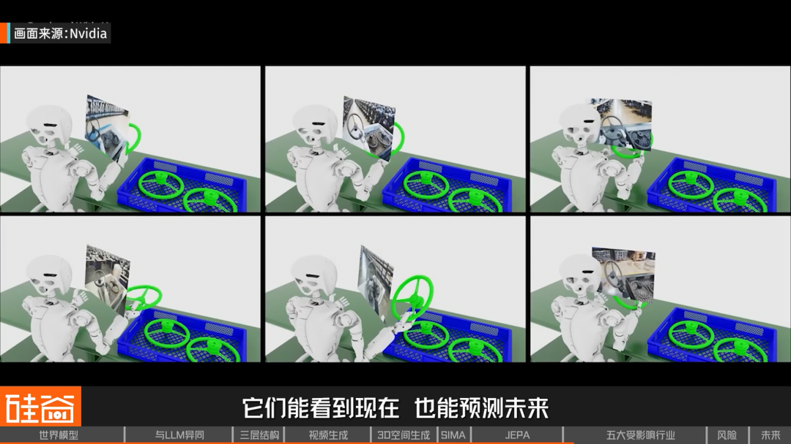

比如它可以模拟箱子会不会翻倒、门把的角度能否顺利转动、路径是否足够安全、抓取是否会失败。过去要花工程师几十小时调参的任务，现在机器人在模拟世界里自主练习就能掌握。

更重要的是，机器人开始具备迁移能力。它不需要每次换一个物体、换一个场景、换一个任务都重新示教一遍，**它能把内部模型里学到的规律迁移到现实世界。**尽管仿真到现实的迁移至今仍是一个开放难题，世界模型有望大幅降低这道门槛，让机器人面对从未见过的物品时，仍然能做出合理决策。

这对机器人来说是一次范式级的改变。无论是家庭服务机器人、仓储机器人、工厂协作机器人、餐饮零售机器人，还是专业级的巡检、建筑、医疗辅助手臂，世界模型都可能成为它们跨过智能门槛的那把钥匙。

## Chapter 6.2 自动驾驶

大约从5年前开始，马斯克就开始讲L5要来了，但为什么时至今天，L5级的自动驾驶依然没有全面普及？背后原因之一就在于：系统虽然“看得见世界”，却还难以真正预测世界。

我们现在常说的L2、L3自动驾驶，本质上依赖的仍然是“感知—预测—规划”的分层体系：识别车、人、车道线、交通灯，再通过规划系统给车辆下指令。

特斯拉更强调用大规模真实道路数据，通过端到端方式不断逼近人类驾驶。而Waymo则长期在高度结构化的系统中，追求可验证的安全性。但无论是哪种路线，都面临一个共同的问题：它们对“现在”的感知已经很强，却很难稳定地理解“接下来会发生什么”。

再加上极端天气、突发事故、不规范行人等长尾场景在真实道路中极其稀少，也成为制约自动驾驶规模化的关键瓶颈。

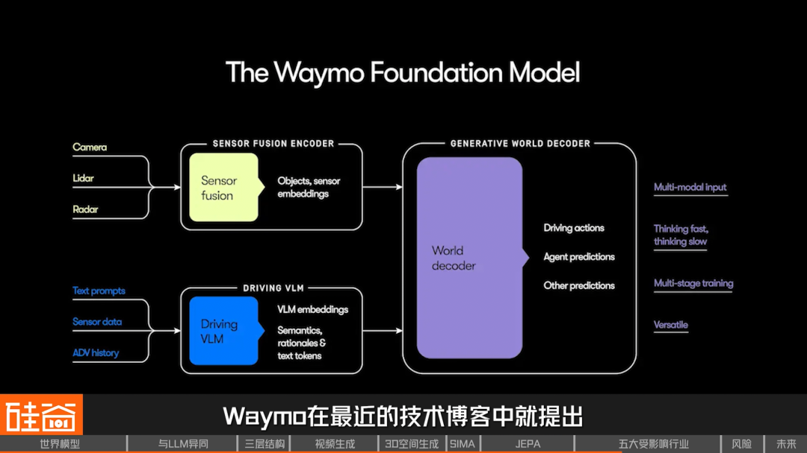

而这正是世界模型开始真正进入工程体系的地方。比如Waymo在最近的技术博客中提出，他们正在将自动驾驶系统的核心，构建为一个Foundation model（基础模型），它采用了“分段式端到端”的架构，内部可以进行端到端训练和反向传播，同时又保留了对世界的结构化表达。这个模型不只是完成单一任务，而是学习“世界如何运转”，它被要求输出物体、语义属性和道路结构等中间表征，让系统在出错时，能够定位问题出在世界理解的哪一层。

这些结构化世界信息，也支撑起更高质量的仿真系统：**不仅还原场景，还能在不同假设下预测交通参与者的行为，并在内部同时推演大量可能的决策路径，从中筛选出最安全、最稳定的一条**。这不再只是“识别”，也不只是“反应”，而是让自动驾驶系统开始具备一种接近人类驾驶的预判能力。

也正因为如此，世界模型被认为是推动自动驾驶从局部可用，走向可验证、安全的大规模商业化落地的核心技术之一。

## Chapter 6.3 穿戴式设备

如今我们所熟知的可穿戴设备，本质上还是停留在记录层面，看上去很智能，但实际上却并不理解你周围的环境。而世界模型会让这一切发生质变：

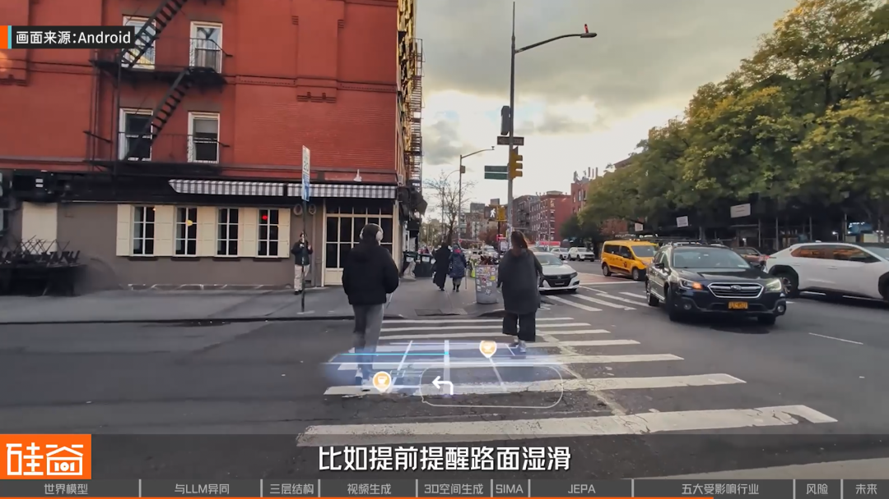

一方面，它能让设备真正读懂你的3D世界，实时推断空间结构、物体关系和潜在风险，把数字内容自然融合进现实环境。另一方面，它的预测和规划能力，会让可穿戴设备从工具变成你的“数字伙伴”。理解你在什么环境、看什么、可能要做什么，比如提前提醒路面湿滑，在厨房识别缺少的食材，甚至在你开口前就意识到你需要帮助。

从更长远看，这不只是设备升级，更是一种新的“人机关系”，**世界模型会让可穿戴设备****，****从“信息终端”变成随身的“世界理解引擎”**，眼镜、耳机、手表，都可能进化为与你共同生活、共同行动的智能体。而这，也可能会是下一代计算平台的起点。

## Chapter 6.4 内容生成、游戏与影视制作

如果说机器人、自动驾驶等“具身智能”是世界模型在现实世界的落地，内容相关的产业，就是世界模型在“想象世界”里的爆发奇点。

如今我们已经看到视频生成模型所带来的一些震撼效果，而世界模型的到来，可以让未来的内容创作只需要给一个世界观、一个任务、一个初始状态，模型就能自动“长出一个世界”。比如在影视行业，一个导演不需要去反复搭景、重拍、做模型，只需要定义“这是一座被雨水淹没的城市”，AI就能生成整个城市的状态变化。

而在游戏行业，世界模型带来的改变更是颠覆性的。过去的游戏世界需要一砖一瓦搭建，地形、天气、物理引擎、NPC行为、任务链等等条件，我们都需要数百人团队、花费几年时间，才能做出一个开放世界。但世界模型意味着游戏世界不需要“制作”，而可以自动生成和进化。一个设计师只需要设定规则、生态、冲突，AI就能生长出森林、河流、生物、文化、经济系统，甚至NPC的性格、记忆和演化方向。

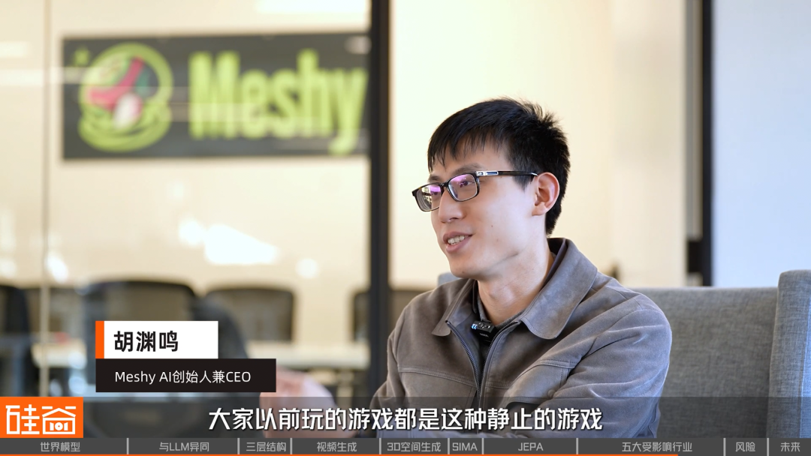

> **胡渊鸣**
>
> **Meshy AI CEO**
>
> 大家以前玩的游戏都是静止的游戏，所有的规则已经被写好了，有一个游戏设计师和游戏程序员去实现这个规则就可以了。但是如果我们在游戏场景当中有这种生成式AI技术，就可以实现游戏是on the fly（即时）生成的。比如谷歌的Genie 3，按上下左右键，它可以on the fly（即时）生成下一秒的东西。
>
> 我们在做的事情就是，先用3D的模型，再自己做一个多模态的大模型，这个大模型可以先生成角色的外形，然后再给它加上人物逻辑，包括它的性格等等各种各样的形式的逻辑。我们通过这条路径也可以实现一个世界模型。

所以**对于整个内容行业来说，世界模型带来的不仅仅是制作效率的提升，而是一场叙事方式、创作方式、内容形式的全面重写。**

## Chapter 6.5 AI Agent

世界模型的到来，还会加速AI Agent的进化。当我们今天在聊AI Agent的时候，很多讨论其实都集中在Agent能不能更聪明、规划能力够不够强、工具调用做得好不好。但如果退一步看，会发现一个更底层的问题一直没有被真正解决：Agent到底是在什么环境里学会“行动”的？

从强化学习的视角看，Agent的一切能力，都来自与环境的交互：执行动作，接收反馈。但真实世界太昂贵、太缓慢，也太危险，几乎不可能支撑大规模试错。

而世界模型解决的，正是“环境”本身的问题。它通过学习真实系统的数据，在模型内部构建一个可运行的世界，当Agent采取行动时，世界模型可以直接推演这个动作可能带来的结果。这样Agent就可以在世界模型中进行大规模训练，如果这个世界足够接近真实，在虚拟环境中学到的能力，就可以稳定迁移到现实系统中。

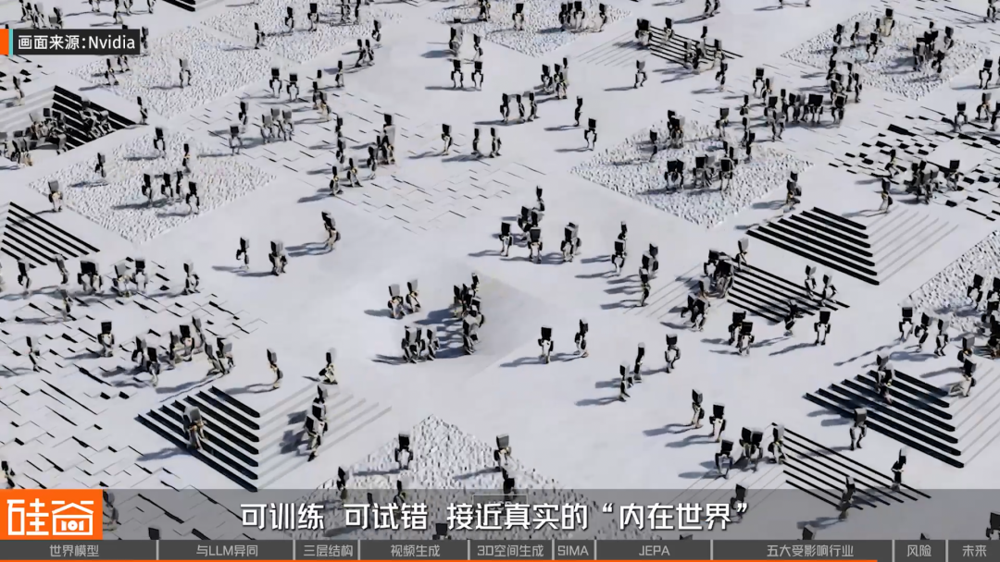

**世界模型并不是让Agent立刻变得更聪明，而是第一次为Agent提供了一个可训练、可试错、接近真实的“内在世界”。**这层世界底座，才是真正决定AI Agent能否走向现实世界的关键。

所以世界模型改变的不只是某一个行业、某一个产品、某一种形态，而是整套人与世界互动的方式。陈羽北在采访中就谈到，如果世界模型真的从根本上走通了，甚至有可能创造出一种新的文明。

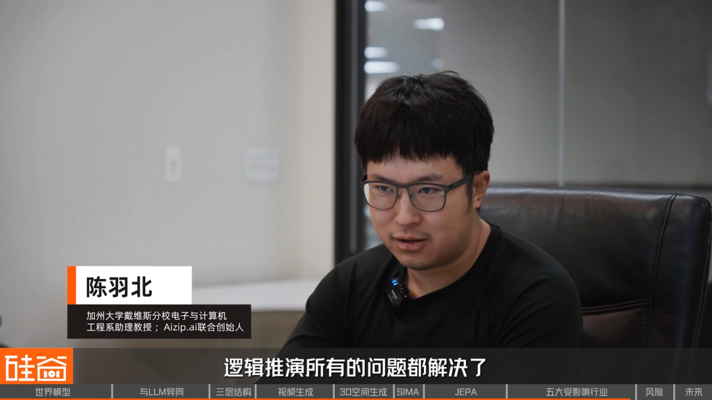

> **陈羽北**
>
> **加州大学戴维斯分校电子与计算机工程系助理教授**
>
> 如果你能实现World model（世界模型），已经包罗万象，把这个世界所有的逻辑问题和规律都掌握了，而且不是简单的外延，而是可以在比较根本的程度上产生泛化，产生数据、产生意识，产生到超越人类的程度。那在给予一定意识的情况下，这个模型似乎已经具备了建立一个新的文明的能力。

**07**

# **世界模型的潜在风险**

当然，任何足以改变技术版图的突破都会带来新的风险。而世界模型的风险，不再只是“胡说八道”那么简单：

**首先，是更隐蔽、也更危险的模型幻觉。**无论哪条路线，世界模型本质上都是在给AI构建一个高度逼真的“梦境”，让它在其中模拟和推演。但虚拟世界永远无法完全覆盖真实世界，始终存在Sim-to-Real Gap（虚实差异）。语言模型的幻觉是编造事实，视频模型的幻觉是画面错误。而世界模型的幻觉，出现在整个“世界结构”里，比如误判物体重量、高估动作可行性、低估碰撞后果，甚至构建了错误的因果关系。

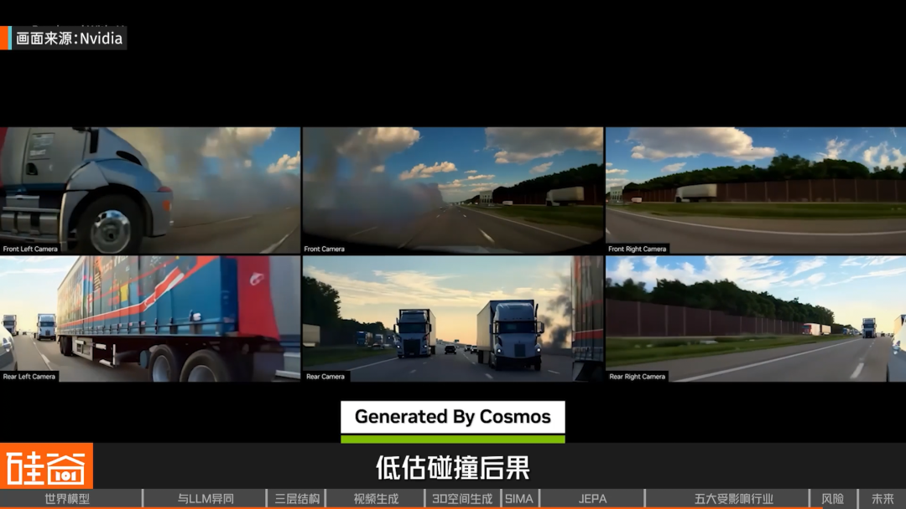

这些问题不一定立刻被察觉，却会直接影响智能体的决策与行动，进而导致机器人失常、自动驾驶偏离，甚至关键系统被系统性误导。所以当世界模型出现幻觉，错误将是“系统级”的，这也是更难发现、更难对齐的风险。

**其次，是世界模型带来的权力集中问题。**未来可能只有极少数机构具备构建和运行世界模型的能力，而成熟的世界模型，意味着前所未有的预测能力。对市场、社会行为、群体反应的高精度推演，可能带来新的信息垄断，也可能被用于更高效的社会操控与商业操纵。

**更重要的是，当世界模型越来越真实，虚拟与现实的边界会越来越模糊，“自主智能体”的到来也加大了AI不受控的风险。**

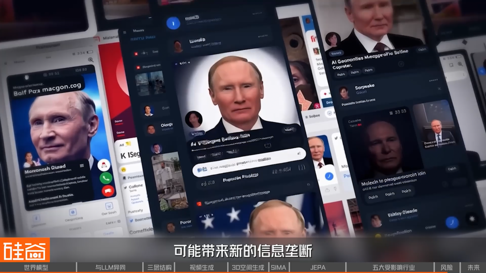

一旦AI真正理解并模拟世界，深度伪造与虚假场景将进入“超真实”阶段，AR/VR世界可能与现实几乎无差，甚至更具吸引力。与此同时，当越来越多真实系统开始依赖这些模型，现实世界本身，也可能反过来“对齐”模型的假设。而当世界模型变成决策底座，内部状态难以审计、推理过程不可见，我们甚至很难判断它究竟“理解”了什么、在朝什么方向演化，这也意味着，它所带来的监管挑战，将远高于今天的大模型。

所以，世界模型潜力巨大，但带来的风险也比我们过去面对的任何AI技术都更危险。它不只是内容层面的风险，而是会真的影响现实世界。

当AI不只是看世界、画世界，而是开始在现实中推演、行动、做决定，我们需要从系统、对齐、伦理、监管所有层面重新讨论这件事。

**08**

# **AI的下一段旅程**

过去一、两年，我们看到了AI在语言、图像、视频上的极速爆发，仿佛一夜之间，AI已经无所不能。但当你开始思考，AI是否真的理解世界，是否能预测未来，是否能像人类一样在世界中行动？你会发现，现在的大模型其实还仍然停留在“表层智能”的阶段。而世界模型，向我们提供了真正走向“深层智能”的可能。

它让AI从“看到世界”走向“理解世界”，从“预测句子”走向“预测未来”，从“生成画面”走向“在世界里行动”。这不仅会改变机器人、制造业、自动驾驶、内容产业，也会改变我们和数字世界的关系，甚至改变我们对“智能”本身的理解。

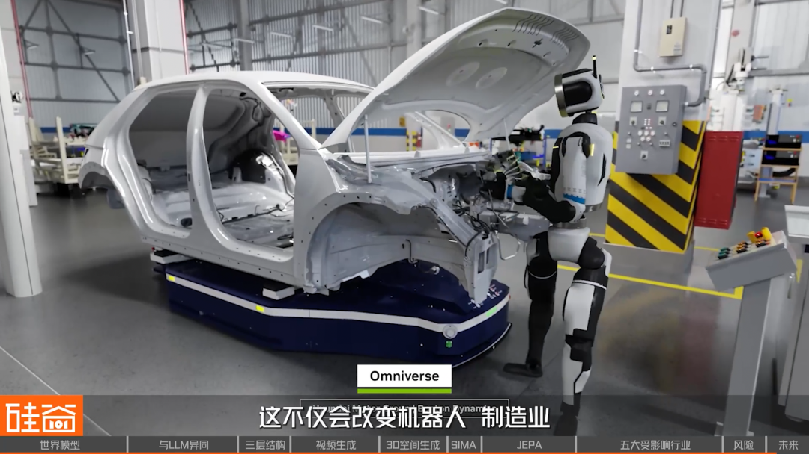

当然，世界模型的道路还很长。它面临巨大的技术挑战，也伴随新的风险。目前我们仍然不知道哪一条路线会最终胜出，但我们知道的是：**当AI能够真正理解世界、模拟世界、在世界里试错和行动时，它离“通用智能”，也就是我们一直在寻找的那个终极目标，又会近了一大步。**而这，也许AI时代真正的拐点,而我们现在，正在见证它的开端。

最后，我们还想补充的是，因为世界模型本身还没有一个被学界和产业完全统一的定义。所以这一期内容，并不是想给世界模型下一个“标准答案”，而是希望从我们的视角，为大家梳理出一个理解世界模型的框架。

不同团队、不同方向的每一条路线背后，其实都牵涉到大量具体的技术细节、方法选择，以及仍在快速演化的新尝试。接下来，我们也会持续围绕这个主题，做更深入的拆解和系列内容，欢迎大家持续关注。

注：部分图片来源于网络

**【本期节目不构成任何投资建议】**

【视频播放渠道】

国内：B站｜腾讯｜视频号｜西瓜｜头条｜百家号｜36kr｜微博｜虎嗅

海外：Youtube

联系我们：video@sv101.net

【创作团队】

监制｜泓君 陈茜

撰稿｜张珺玥

文稿编辑｜陈茜 王梓沁

文稿支持｜Kolento

主持｜陈茜

剪辑｜Jacob

动效｜踹 AK12

运营｜孙泽平 王梓沁